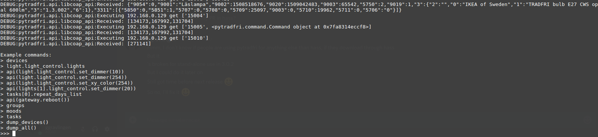

[](https://coveralls.io/github/ggravlingen/pytradfri?branch=master)
[](https://badge.fury.io/py/pytradfri)
[](https://houndci.com)

Python package to communicate with the [IKEA Trådfri](http://www.ikea.com/us/en/catalog/products/00337813/) (Tradfri) ZigBee Gateway compatible with ZigBee Light Link products. By using this library you can communicate with the gateway and control IKEA's lights and wall plugs.

Some of the features include:

- Get information on the gateway
- Observe lights, groups and other resources and get notified when they change
- Control wall plugs
- List all devices connected to gateway
- List all lights and get attributes of lights (name, state, color temp, dimmer level etc)
- Change attribute values of lights (name, state, color temp, dimmer level etc)
- Restart and reset the gateway
- List smart tasks (wake up, on/off and not home) and their attributes
- Alter values in smart tasks (some of these features not available in app yet)

Table of contents:

1. [Installation](#installation)
2. [Verified Device Compatibility](#verified-device-compatibility)
3. [Stand-alone use (command-line interface)](#stand-alone-use-command-line-interface)
4. [Implement in your own Python platform](#implement-in-your-own-python-platform)
5. [Docker support](#docker-support)
6. [Known issues](#known-issues)
7. [Acknowledgements](#acknowledgements)

## Installation
You might have to use superuser privileges (sudo) for some commands to work when installing.

To use the library in a synchronous application, you first need to install [libcoap](https://github.com/obgm/libcoap) using [this script](script/install-coap-client.sh). Use [examples/example_sync.py](https://github.com/ggravlingen/pytradfri/blob/master/examples/example_sync.py) when testing this.

For asynchronous applications you will need to install `pytradfri[async]`, for instance using the requirements file: `pip install pytradfri[async]`. Please note that install might take considerable time on slow devices. Use [examples/example_async.py](https://github.com/ggravlingen/pytradfri/blob/master/examples/example_async.py) when testing this.

Security best practice is to ***not*** store the security code that is printed on the gateway permanently in your application. Please always use the PSK when communicating with the gateway.

## Verified Device Compatibility

|Device|Version|
|---|---|
|IKEA Gateway (E1526)|1.8.25|
|TRADFRI bulb E14 WS opal 400lm|1.2.217|
|TRADFRI bulb E27 WS opal 980lm|1.2.217|
|TRADFRI bulb E27 W opal 1000lm|1.2.214|
|TRADFRI remote control|1.2.214|
|TRADFRI motion sensor|1.2.214|
|TRADFRI wall plug|2.0.022|

## Stand-alone use (command-line interface)


If you want to test this library stand-alone in a command-line interface:

```shell
$ python3 -i -m pytradfri IP
```
Where **IP** is substituted by the IP-address to your gateway.

The first time running pytradfri you will be asked to input the 'Security Code' found on the back of your IKEA gateway.

### Examples of commands in the stand-alone prompt:

List all lights:

```python
lights
```

Set the brightness of item 1 to 50 in lights list:

```python
api(lights[1].light_control.set_dimmer(50))
```

Observe a light for changes:

```python
def change_listener(device):
  print(device.name + " is now " + str(device.light_control.lights[0].state))

api(lights[0].observe(change_listener))
```

## Implement in your own Python platform

Please see the example files.

## Docker support

There is a Docker script available to bootstrap a dev environment. Run `./script/dev_docker` and you will build and launch a container that is ready to go for both sync and async. After launching, follow the above instructions to test the library stand-alone.

The working directory of the Docker image is `/usr/src/app`. The checked out version of this repo is added there and installed as a Python dependency for easy development and testing. When you want to use the latest stable version from pip, you only have to change to another working directory.

## Known issues
We are aware of issues some users face with their gateways. Anecdotal evicence suggests sending many requests (spamming) the gateway, or an unreliable network connection can be the culprit. As a first solution, try to limit the number of requests, and move the Gateway closer to the device running pytradfri on the nework. Other than that, there is unfortunately not anything this project can do to support or resolve these issues at this time. As this progresses, we will ensure the project is kept up-to-date.

## Acknowledgements

This is an implementation based on analysis [I](https://github.com/ggravlingen/) found [here](https://bitsex.net/software/2017/coap-endpoints-on-ikea-tradfri/) by [vidarlo](https://bitsex.net/).

Paulus Schoutsen ([@balloob](https://github.com/balloob)) made a working Python library of the initial code concept. Lewis Juggins ([@lwis](https://github.com/lwis)) added support for asyncio and improved management of dependencies and consistency around return types. Many others have [contributed](https://github.com/ggravlingen/pytradfri/graphs/contributors) too.
